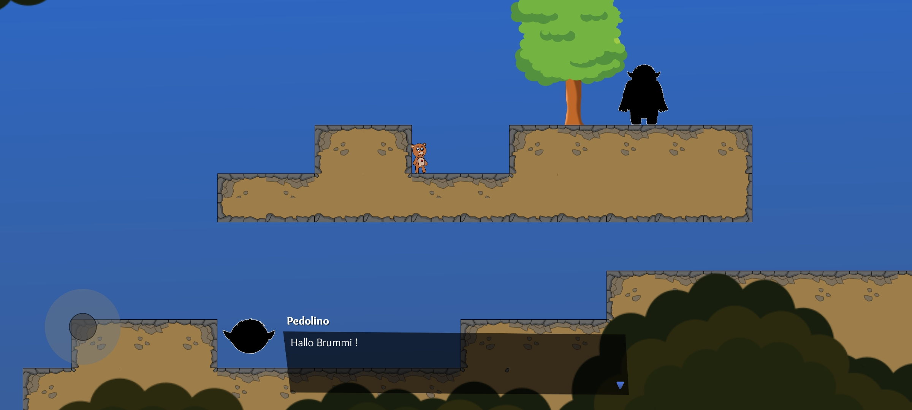

# Brummi Adventure Jump and Run Game
This could be a beautiful cross platform game, telling kids not going out with strangers,
or explain kids what is ok and what not. The idea of the game is to get the attention of kids with a good gameplay and start dialogs with predators. Currently the game is in German but we are open for any language. Give predators no chance to abuse or rape kids with preventive work in this case. 

# Who is Brummi?
Brummi is a little bear created by Björn Scholz a child protection activist.
You can find more information about Brummi here:

www.brummi.net

# Engine

This Project is created with Godot (tested Version: Godot_v3.4.1-rc1_mono_x11_64 ). We try to use C# as main language. PR's are welcome!

# TODO
- [ ] Create a better documentation
- [ ] Define project structure
- [ ] Continous integration
- [ ] Create more sprites

# Screenshot
## Mobile

